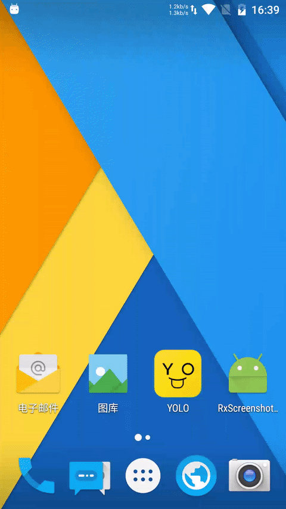

# RxScreenshotDetector
Android screenshot detector with ContentObserver and Rx.

Note that this library only work as best effort, it won't (and can't I think) cover corner cases. Good luck with it :)

## ScreenShot



## Usage
Add to gradle dependency of your module build.gradle:

```gradle
repositories {
    jcenter()
    maven { 
        url "http://dl.bintray.com/tbruyelle/tbruyelle" 
    }
}

dependencies {
    compile 'com.github.piasy:rxscreenshotdetector:1.0.5'
}
```

Use in code:

```java
RxScreenshotDetector.start(getApplicationContext())
        .subscribeOn(Schedulers.io())
        .observeOn(AndroidSchedulers.mainThread())
        .compose(this.<String>bindUntilEvent(ActivityEvent.PAUSE))
        .subscribe(new Subscriber<String>() {
            @Override
            public void onCompleted() {

            }

            @Override
            public void onError(Throwable e) {
                e.printStackTrace();
            }

            @Override
            public void onNext(String path) {
                mTextView.setText(mTextView.getText() + "\nScreenshot: " + path);
            }
        });
```

See [full example](https://github.com/Piasy/RxScreenshotDetector/tree/master/app) for more details.

[Download demo apk](https://www.pgyer.com/yaVT).

## Dev tips
+  You need create an empty file named `bintray.properties` under root project dir, which is used for uploading artifact to bintray.

## Acknowledgements
+  `unsubscribeInUiThread` method is grabed from [ReactiveNetwork](https://github.com/pwittchen/ReactiveNetwork).
+  Thanks for [RxPermissions](https://github.com/tbruyelle/RxPermissions), for request permission in reactive way.
+  Thanks for [YOLO](https://www.yoloyolo.tv/), the yello smiling face.
